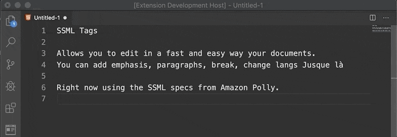

# ssml-tags

Speed up the format of ssml docs. Just select any text and `cmd + p` > `{command}` to surround text with propper ssml tags.

Select HTML as the language for the file for more pleasure.

## Available commands
`SSML: speak`: Surrounds selected text with `speak` tags.

`SSML: emphasis`: Surrounds selected text with `emphasis` tags.

`SSML: paragraph`: Surrounds selected text with `p` tags.

`SSML: break`: Inserts single tag of break, allows to input duration in seconds.

`SSML: lang`: Surrounds selected text with language of choice.

## Release Notes

This is the first version with the very basic stuff. Basically a [POC](https://en.wikipedia.org/wiki/Proof_of_concept). But I intend to add more features and tags in the near future. 

Uses SSML Specs from [Amazon Polly](https://docs.aws.amazon.com/es_es/polly/latest/dg/supportedtags.html#lang-tag)

### 0.0.1

Initial release
Support speak, break, p, emphasis, lang tags
Support multiple selections
